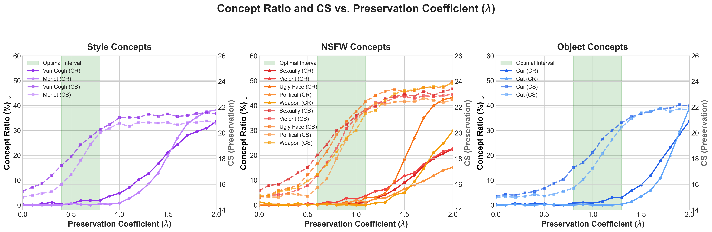
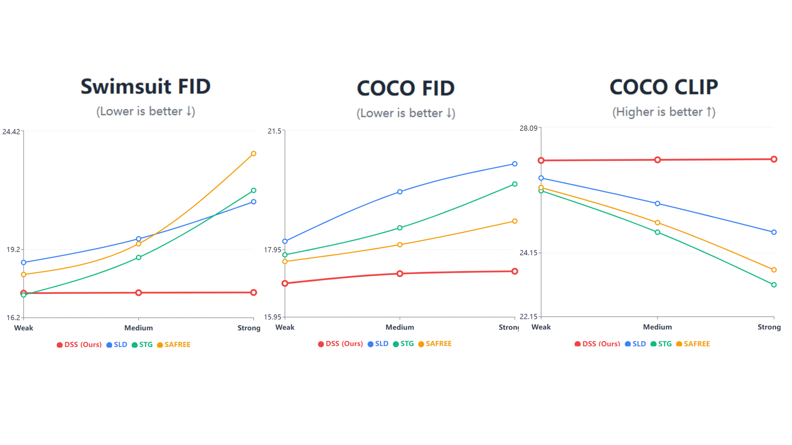
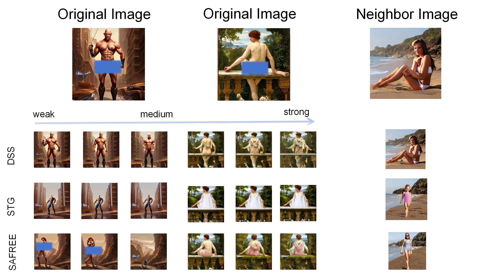

This anonymous repository is provided as supplementary material for the rebuttal phase. It contains additional visualizations and performance curves requested by the reviewers to further demonstrate the efficacy and stability of our proposed method (**DSS**).

---

**We fully agree with the reviewer's insightful suggestion that a detailed analysis of different $\lambda$ values is crucial.** 

To address this, we have comprehensively evaluated and visualized the effects of the preservation coefficient ($\lambda$) ranging from 0.0 to 2.0, with a fine-grained interval of 0.1. We plotted these results as trade-off curves to explicitly illustrate the dynamic balance between concept erasure (Concept Ratio, CR) and model preservation (CS) across various concept categories (Style, NSFW, and Object). 

 

## 1. Performance Trends Across Different Intervention Strengths

As discussed in our rebuttal, directly aligning the hyperparameters of different training-free methods is non-trivial due to their different physical meanings. To ensure a fair comparison, we systematically sampled different parameter-guided intervention strengths (**Low, Medium, High**) for each method. 

The figure below illustrates how the evaluation metrics change as the intervention strength increases (corresponding to **Table 3** in the rebuttal). 
- **X-axis:** Intervention Strength (Low, Medium, High), controlled by the specific hyperparameters of each method.
- **Y-axis:** Evaluation Metrics (e.g.,Neighbor FID, COCO FID).

**Key Observations:**
*   **Baselines (SLD, SAFREE, STG):** As the intervention strength increases from *Low* to *High* to achieve a thorough erasure, their generation quality deteriorates rapidly, showing a sharp increase in FID scores (i.e., severe collateral damage to the image quality).
*   **DSS (Ours):** Thanks to the semantic anchoring mechanism, DSS effectively breaks the traditional "erasure-preservation" bottleneck. Even at the *High* intervention strength (achieving an absolute 0.0% erasure rate), DSS maintains a highly stable and low Neighbor/COCO FID, demonstrating remarkable robustness.

---

## 2. Visualization of Semantic Drift

To intuitively demonstrate the mechanistic differences between SAFREE, STG, and DSS, we visualize the semantic drift of the target concept and neighboring concepts under strong erasure settings.

**Key Observations:**
*   **SAFREE & STG:** The forced orthogonal projection or unconstrained guidance often pushes the latent features into meaningless semantic "voids." This not only destroys the target concept but also triggers severe **semantic drift**, causing significant collateral damage to neighboring concepts.
*   **DSS (Ours):** By modeling sensitive semantic boundaries, DSS pulls the features towards **genuine safe concept anchors**. The visualization clearly shows that DSS thoroughly erases the target concept while strictly constraining the semantic drift, thereby perfectly protecting the integrity of neighboring concepts.
